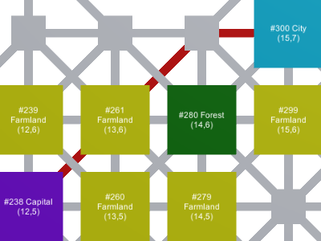

# Map Pathfinding

This is a prototype made in Unity (2020.1.12) for a game I'm making. It's a map with places you can go and I've programmed an implementation of the Dijkstra algorithm to draw the shortest path between two places.

**Controls**:
 - Left mouse click: select the path origin (click again to deselect)
 - Right mouse click: select the path destination (click again to deselect)
 - If you've selected two valid places, the shortest path between them will appear
 - Note: You can only select the brightly colored places for a path and not what I've called the crossroads (smaller dots the same color sa the roads)

## Generating the map
I haven't done proper benchmarking, but I though it would be fun do do a few tests.

It takes ~7 seconds on my PC to generate a 27x27 map with about 75% of the tiles filled (545 tile out of the 729). I currently use Parallel.ForEach to speed things up and it reduces the time it takes to generate by about 50% for the same map (from 15s to 7s). I've tested a 45x45 map and it took about 1:20 to generate, which seems fair since the algorithm is about O(n^2).

Most of the algorithm (Dijkstra) takes place in the ``Scripts/Map/Graph/Graph.cs`` file. There you'll find 3 methods. The first, ``GenerateLinkTablesParallel()``, uses the parallel foreach I mentionned above and is the one currently in use. The second, ``GenerateLinkTables()``, is the same but without parallelisation. Finally, ``GenerateLinkTablesVue()``, uses Coroutines do display the algorithm step-by-step by highlighting the paths it is checking for or has validated. You may need to uncomment certain parts of the code if you want to test the generate methods other than the parallel one.